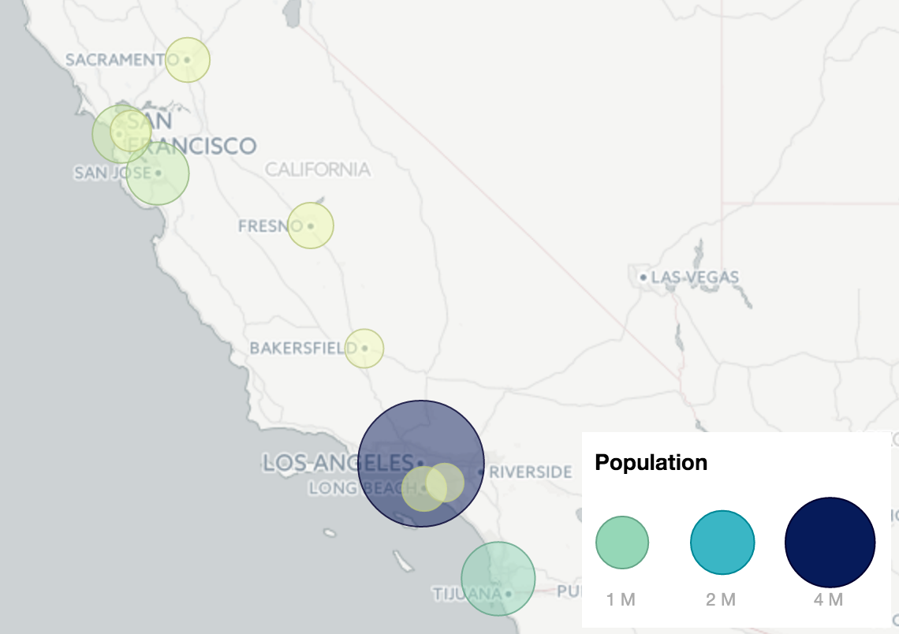

Leaflet.bubble
==========

A simple library for visualizing bubble maps (or circle cartograms) with Leaflet and Mapbox. 
Maintained by [@stevepepple](twitter.com/stevepepple) and [OpenGov](https://github.com/OpenGov).

[Demo is here](http://stevepepple.github.io/Leaflet.bubble/)

## About
This plugin is designed for Leaflet and Mapbox. All you need is a geoJSON file with a numeric value that will be visualized.

This library is inspired by CartoDB bubble maps and [Vladimir Agafonkin's Leaflet heatmap plugin](https://github.com/Leaflet/Leaflet.heat).

As with bubble charts, the size of the bubble's area should be used to visualize quantities, not the bubble radius. This library takes a value for each point and scales the area of map circles.

  


## Basic Usage

```js
bubbles = L.bubbleLayer(ca_cities, { property: "population" })
```

To include the plugin, just use `leaflet-bubble.js` from the `dist` folder:

```html
<script src="leaflet-bubble.js"></script>
```

## Building
To build the dist files run:
```npm install && npm run prepublish```

## Reference

#### L.bubbleLayer(geoJSON, options)

Creates a bubble or circle cartogram layer given an geoJSON file of points. Library accepts the following options.
You MUST specify a **property** field that is a **numeric** value.

Here are the other options:

- **color** - fill and border color of the bubbles or circles
- **legend** - show a legend; `true` by default
- **max_radius** - show a legend; `35` by default
- **scale** - use a brewer color scale; `false` by default (use any [brewer scales supported by chroma.js](http://gka.github.io/chroma.js/#chroma-brewer))
- **style** - visual options for the bubble or circle `{ radius: 10, fillColor: "#74acb8", color: "#555", weight: 1, opacity: 0.8, fillOpacity: 0.5 }` is default (use any Leaflet.circle options)
- **tooltip** - show a info toolip when on bubble hover, tap, or click; 'true' by default;

Currently, this library only supports [geoJSON objects](http://leafletjs.com/examples/geojson.html) with points or geographic coordinates (longitude-latitude).

## Changelog

### 0.1 &mdash; Mar 12, 2015
